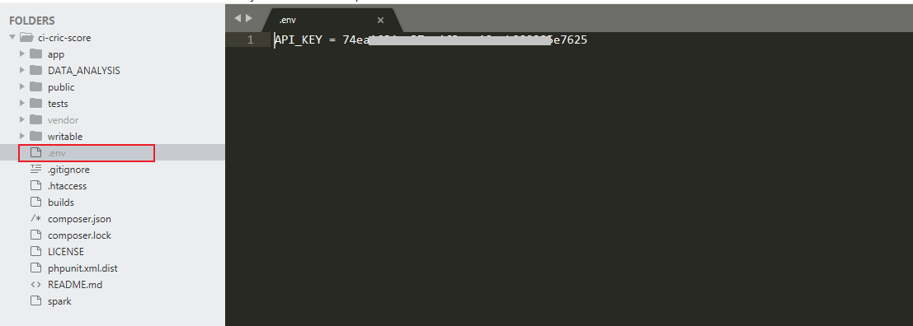

# CricScore

A simple **CodeIgniter** application that displays basic cricket information such as Series list, Series info, Matches list and Match info.
Ball by ball information is not integrated as its paid service. But yes it can be easily integrated.
 
## Setup

* Create a developer account in [cricket data](https://cricketdata.org/)
* Get the api key.
* Create **.env** file at project root.
* Edit the file with below content
	```sh
	API_KEY = YOUR_API_KEY
	```
	
	
---


